# Customer Churn Prediction

> End-to-end ML pipeline predicting telecom customer churn with 79% accuracy, 0.74 ROC-AUC, threshold optimization, SHAP explainability, and quantified business recommendations.

---

## Results at a Glance

| Model               | Accuracy | F1 Score | ROC-AUC |
| ------------------- | -------- | -------- | ------- |
| Logistic Regression | 79%      | 0.58     | 0.71    |
| XGBoost             | 77%      | 0.51     | 0.68    |
| Random Forest       | 79%      | 0.56     | 0.74    |

> Threshold optimized from 0.50 to reduce false negatives and improve churn detection performance.

---

## Random Forest ROC Curve

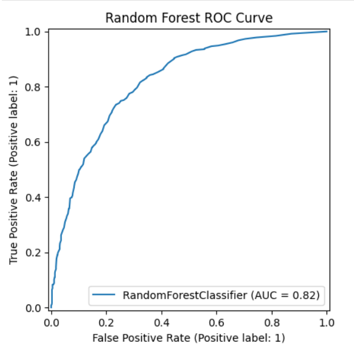

---

## Random Forest Confusion Matrix

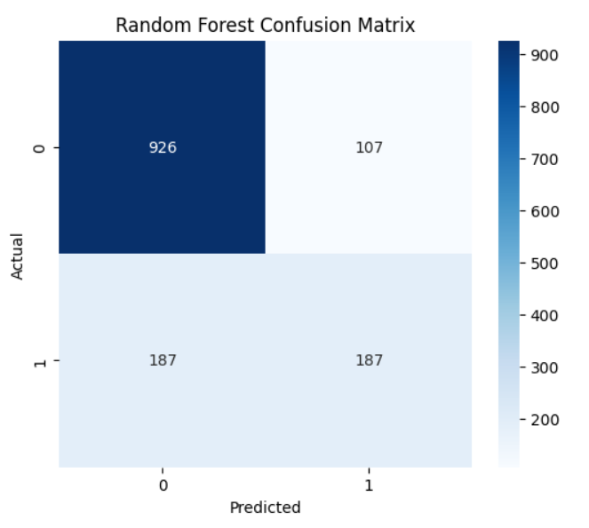

---

## Optimized Confusion Matrix

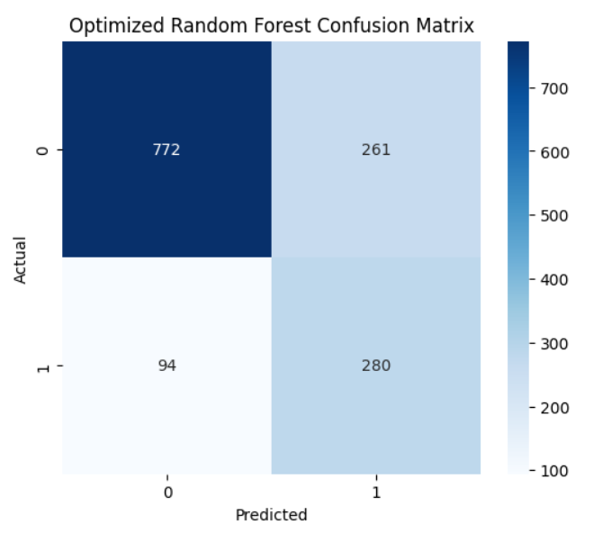

---

## Problem

Telecom companies lose **15–25% of customers annually** to churn. Acquiring a new customer costs significantly more than retaining an existing one.

Traditional analytics often fail to identify customers likely to leave before churn actually happens. This project builds a machine learning pipeline capable of predicting churn risk early using customer demographics, subscription details, billing information, and behavioral patterns.

The project focuses not only on prediction accuracy but also on:

* threshold optimization
* explainability
* business interpretation
* actionable retention strategies

---

## What Makes This Project Different

| Feature                      | Why It Matters                                              |
| ---------------------------- | ----------------------------------------------------------- |
| sklearn Pipeline             | Prevents data leakage and creates production-ready workflow |
| Custom feature engineering   | Engineered features outperform raw variables                |
| Threshold optimization       | Business-aware classification instead of default cutoff     |
| SHAP explainability          | Explains why customers are predicted to churn               |
| Quantified business insights | Converts ML output into retention strategy                  |
| Saved model (.pkl)           | Ready for deployment and inference                          |

---

## Feature Engineering

| Feature              | Logic                                | Business Meaning                       |
| -------------------- | ------------------------------------ | -------------------------------------- |
| `tenure_band`        | Groups customers by loyalty duration | Helps identify retention stages        |
| `charges_per_tenure` | `TotalCharges / (tenure + 1)`        | Detects expensive short-term customers |
| `total_services`     | Count of subscribed services         | Measures switching cost and engagement |

---

## Business Insights

### 1. Contract Type Strongly Impacts Churn

Month-to-month customers showed the highest churn rates, while long-term contract customers were significantly more stable.

#### Contract Type vs Churn Percentage

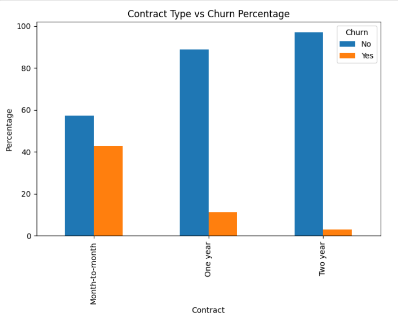

---

### 2. Customer Retention Improves with Higher Tenure

Customers staying longer with the company had substantially lower churn probability.

#### Tenure Band vs Churn Percentage

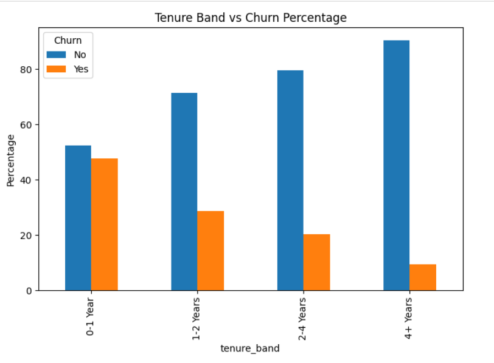

---

### 3. High Monthly Charges Increase Churn Risk

Customers with higher monthly charges were more likely to leave the service.

#### Monthly Charges Distribution

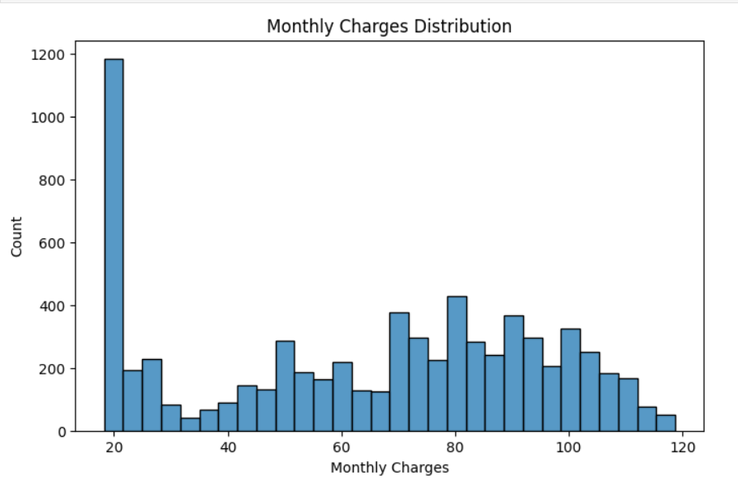

---

## SHAP Explainability

SHAP (SHapley Additive exPlanations) was used to interpret model predictions and identify the most influential churn-driving factors.

Top influential features:

1. TotalCharges
2. tenure
3. MonthlyCharges
4. charges_per_tenure
5. InternetService_Fiber optic

---

### SHAP Summary Plot

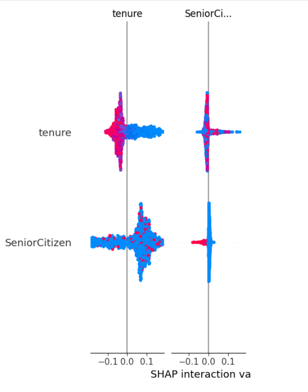

---

### SHAP Bar Plot

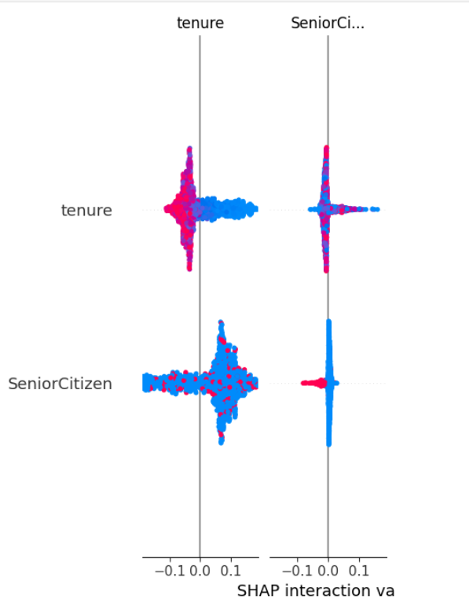

---

## Feature Importance

### Top 10 Important Features

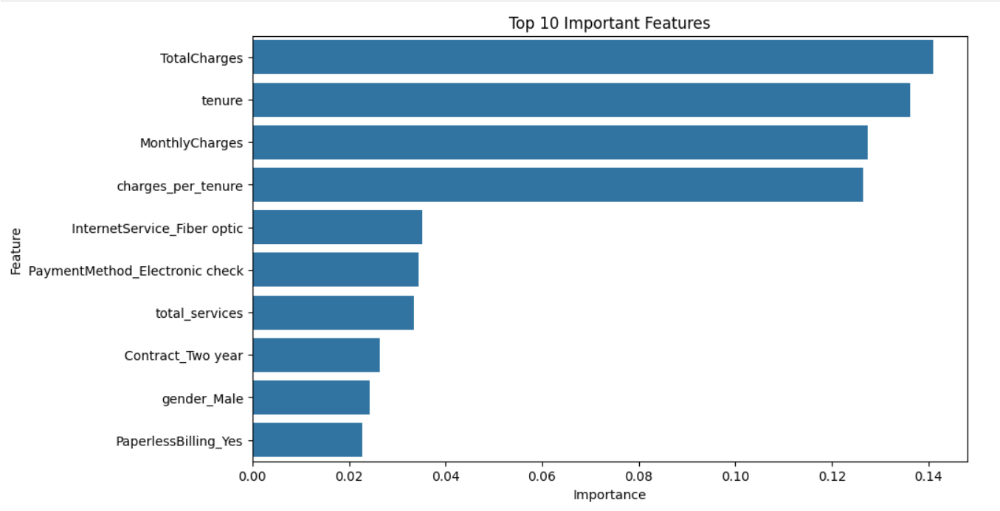

---

## Exploratory Data Analysis

### Churn Distribution

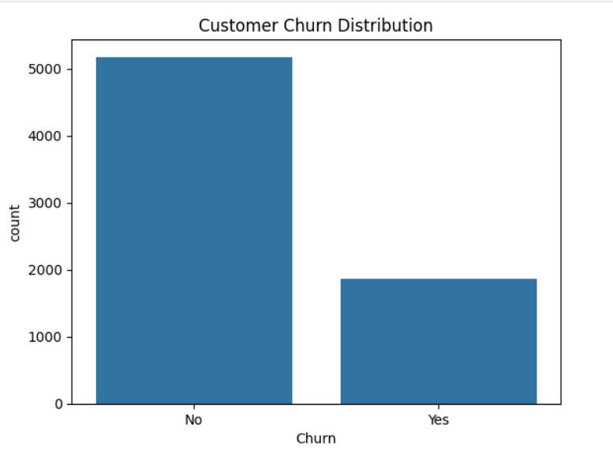

---

### Customer Tenure Distribution

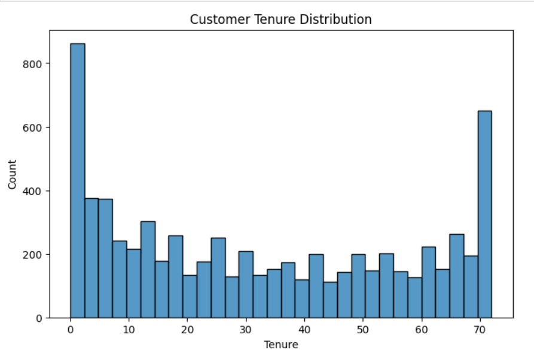

---

### Total Services Distribution

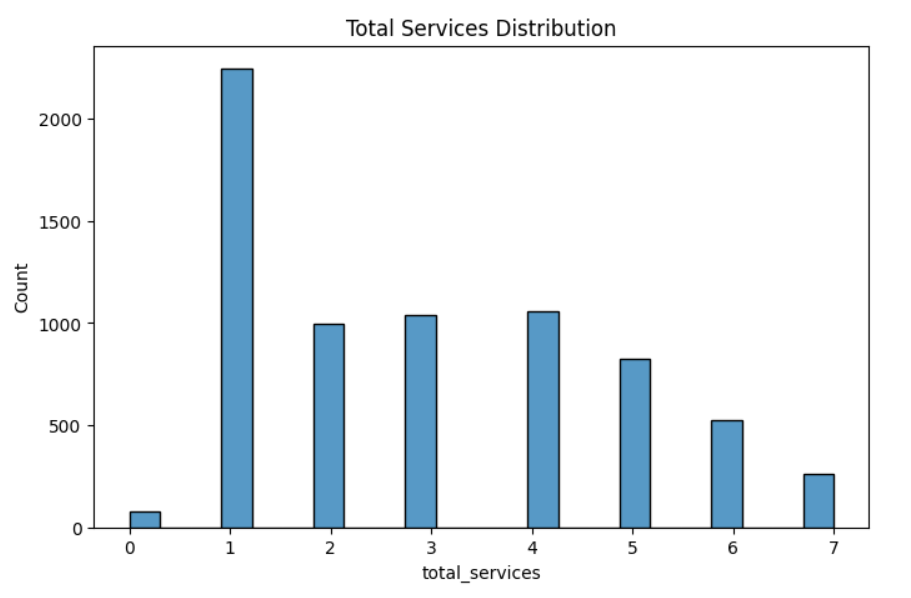

---

## Project Workflow

```plaintext
Raw Data → Data Cleaning → EDA → Feature Engineering
    → Encoding → Train-Test Split
        → Pipeline Build → Model Training
            → Threshold Optimization
                → SHAP Explainability
                    → Business Insights
```

---

## Tech Stack

```plaintext
Python · Pandas · NumPy · Scikit-learn · XGBoost · SHAP · Matplotlib · Seaborn · Joblib
```

---

## How to Run

```bash
git clone https://github.com/UrvashiPandey-04/customer-churn-prediction
cd customer-churn-prediction

pip install -r requirements.txt

jupyter notebook notebook/customer_churn_prediction.ipynb
```

> Dataset: IBM Telco Customer Churn Dataset
> Place `WA_Fn-UseC_-Telco-Customer-Churn.csv` inside the `data/` folder.

---

## Repository Structure

```plaintext
customer-churn-prediction/
│
├── data/
│   └── WA_Fn-UseC_-Telco-Customer-Churn.csv
│
├── notebook/
│   └── customer_churn_prediction.ipynb
│
├── models/
│   └── best_churn_model.pkl
│
├── images/
│   ├── churn_distribution.png
│   ├── confusion_matrix.png
│   ├── roc_curve.png
│   ├── feature_importance.png
│   ├── shap_summary.png
│   └── ...
│
├── requirements.txt
├── README.md
└── .gitignore
```

---

## Future Scope

* Deploy using Streamlit or FastAPI
* Add real-time churn prediction dashboard
* Experiment with deep learning models
* Implement advanced hyperparameter tuning
* Add cross-validation pipeline

---

## Author

**Urvashi Pandey**
